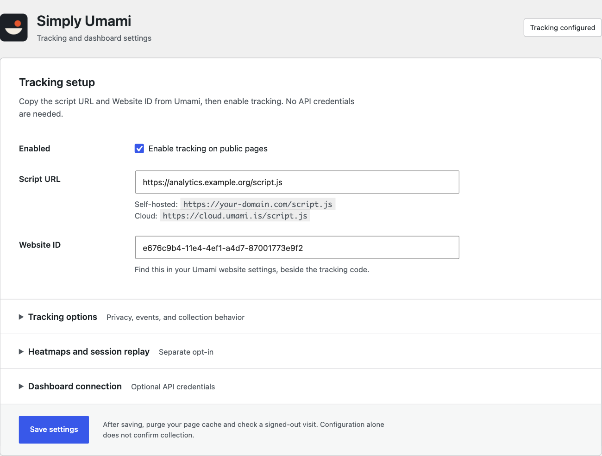
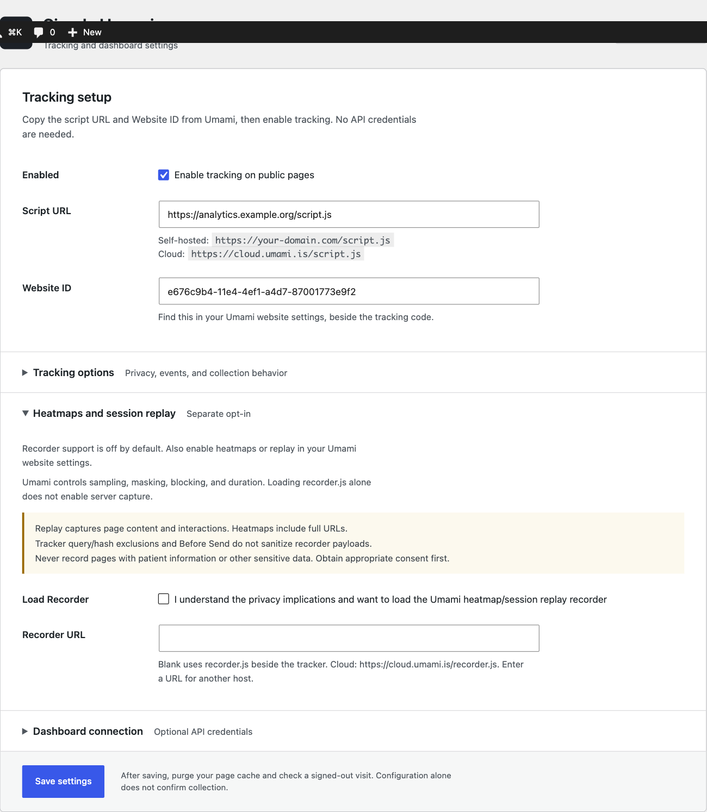

# Simply Umami


WordPress integration for self-hosted Umami Analytics and Umami Cloud. Based on [Integrate Umami by Ancocodet](https://github.com/Ancocodet/wp-umami), licensed GPLv3 or later.

Version: **1.1.1**. Requires WordPress 6.0+ and PHP 7.4+. Tracking in 1.1.0 was verified with WordPress 7.1.2 and a real Umami v3.4.0 server; 1.1.1 changes the settings presentation, not collection.

Submitted to WordPress.org on October 5, 2026 as `nerveband`. The automated scan passed; manual review is pending. The provisional slug is `simply-umami`. Afiyah runs the submitted 1.1.1 ZIP with its existing tracking settings and recording disabled.

## Setup

1. Install the complete plugin ZIP and activate Simply Umami.
2. Open **Settings > Simply Umami**.
3. Copy the **Script URL** and **Website ID** from your Umami website tracking code.
4. Check **Enabled** and save.
5. Purge LiteSpeed, other page caches, and CDN caches where applicable.
6. Test as an anonymous visitor. Administrators are excluded by default.

API access is optional. Self-hosted instances use a username and password; Umami Cloud uses an API key and `https://api.umami.is/v1`. Tracking works without dashboard API credentials.

## Settings

The settings page separates tracking setup, privacy controls, recording, and dashboard API access. These screenshots use synthetic configuration.



<details>
<summary>Recorder settings and privacy warning</summary>



</details>

## Website-side feature coverage

Every data attribute read by the official v3.4.0 tracker is configurable:

| Tracker attribute | Plugin setting |
|---|---|
| `data-website-id` | Website ID |
| `data-host-url` | Host URL and Use Host URL |
| `data-before-send` | Global JavaScript callback name |
| `data-distinct-id` | Optional fixed pseudonymous ID, or dynamic filter |
| `data-tag` | Tag |
| `data-auto-track` | Automatic tracking |
| `data-auto-pageview` | Separate automatic pageview control |
| `data-do-not-track` | Respect Do Not Track |
| `data-exclude-search` | Exclude query strings |
| `data-exclude-hash` | Exclude URL fragments |
| `data-domains` | Domain allowlist |
| `data-fetch-credentials` | Omit, Same Origin, or Include |
| `data-performance` | Performance/web-vitals collection |

The plugin loads the official scripts rather than implementing a partial tracker. Native `umami.track()`, event data, `data-umami-event` attributes, `umami.identify()`, and revenue events remain available. For example, after the tracker loads:

```js
window.umami.track('purchase', { revenue: 12.5, currency: 'USD' });
```

Reports, goals, funnels, journeys, retention, attribution, boards, heatmap visualization, and replay playback remain in the Umami application. The integration supplies their website-side data; it does not recreate the complete Umami reporting application inside WordPress. Cloud features remain subject to your plan and permissions.

## Heatmaps and session replay

Recorder loading is **off by default**. Enable the desired recording features in your Umami website settings, then explicitly enable **Load Recorder** in WordPress. Umami controls sampling, masking, block selectors, and duration.

An empty Recorder URL resolves to `recorder.js` beside the configured tracker script, without inheriting its query string or fragment. An explicit URL supports a separate recorder host or custom filename. Umami Cloud normally uses `https://cloud.umami.is/recorder.js`. When assets use a CDN, set the shared collection-host override where needed.

Both scripts are deferred in document order, tracker before recorder. Recording needs a tracked session and server-side recording enablement. Verify successful `/api/record` requests and stored heatmap/replay data, not merely the presence of a script element.

**Privacy:** replay can capture page content and interactions. Heatmaps include full URLs. Tracker query/hash exclusions and Before Send do not sanitize recorder payloads. Do not enable recording on pages containing patient information or other sensitive data. The plugin does not provide a consent banner, bypass service restrictions, or guarantee regulatory compliance. See [readme.txt](readme.txt) for complete external-service disclosures.

## Extension hooks

`simply_umami_tracker_attributes` receives the data-attribute map and saved options. Values are escaped and only `data-*` attribute names are emitted. It supports dynamic pseudonymous identities and future tracker attributes without modifying the plugin.

```php
add_filter( 'simply_umami_tracker_attributes', function ( $attributes, $options ) {
    // Use your own consent-aware pseudonymous identifier, not personal data.
    $attributes['data-tag'] = 'campaign-a';
    return $attributes;
}, 10, 2 );
```

`simply_umami_tracking_allowed` suppresses the tracker and recorder on a page. `simply_umami_recorder_enabled` can suppress only recording. Both receive the current decision and saved options. For example:

```php
add_filter( 'simply_umami_recorder_enabled', function ( $enabled, $options ) {
    return $enabled && ! is_page( array( 'patient-forms', 'portal' ) );
}, 10, 2 );
```

Server-side filters do not replace a browser consent manager. Ensure page caches do not defeat any consent-dependent decisions.

## Changes in 1.1.1

The settings page uses WordPress-styled fields, native keyboard-accessible disclosure controls, and a local icon. “Tracking configured” describes saved settings; it does not confirm collection. Tracking options, storage, nonce handling, and recorder opt-in are unchanged. The admin icon and directory graphics use the same bowl-and-data-point mark.

## Changes in 1.1.0

* Add opt-in heatmap/session replay support and configurable recorder URL.
* Cover all current tracker attributes, including performance, automatic pageview control, distinct IDs, and fetch credentials.
* Add page/consent gating, recorder gating, and extensible data-attribute filters.
* Preserve configuration on deactivation.
* Correct current v3 statistics and active-visitor response handling.
* Route Cloud API requests to the correct API host and version prefix.
* Include the current time in the rolling 30-day dashboard window.
* Preserve custom ports and application base paths in derived recorder, dashboard, and API URLs.
* Use the WordPress script queue with an explicit recorder-to-tracker dependency.
* Remove obsolete `data-cache`; correct Do Not Track guidance.
* Replace PHP 8-only Cloud detection with PHP 7.4-compatible hostname matching.

The deployed 1.0.0 implementation was recovered through WordPress's authenticated, read-only plugin editor. GitHub main previously contained upstream Integrate Umami 0.8.3 rather than the deployed Simply Umami source. The recovery preserves the API and tracker features already installed on the site.

## Development and verification

```sh
composer install
npm ci
npm run start
npx playwright install chromium
npm test -- --reporter=line
```

The existing `wp-env` configuration mounts this plugin and runs WordPress at `http://localhost:8888`. Integration regressions cover tracker controls, disabling tracking, administrator exclusion, configuration persistence across deactivation, legacy migration, recorder URL derivation, recorder privacy boundaries, and custom-port/base-path dashboard links.

The real v3.4.0 smoke observed browser pageview collection, dashboard values, click/scroll heatmap events, stored replay chunks, performance events, a synthetic distinct identity, and a native USD revenue event. Authenticated Umami Cloud behavior requires an actual Cloud account and was not exercised by that self-hosted smoke.

For a production package, run `composer install --no-dev --optimize-autoloader` and include `simply-umami.php`, `inc/`, `css/`, `js/`, `vendor/`, `composer.json`, `LICENSE.md`, and `readme.txt` under one `simply-umami/` directory. Do not include tests, node_modules, Git metadata, credentials, or local environment files.

## WordPress.org release

WordPress.org accepted the submitted 1.1.1 ZIP for manual review under the provisional slug `simply-umami`. Check review status through [Add your plugin](https://wordpress.org/plugins/developers/add/) using the owner account.

Submitted ZIP SHA-256:

```text
d07c1350412a8f85c3c1b6cea809ac031526d1389ab163d67ab05ee8af09b169
```

Directory approval must come before SVN publication. Do not deploy to `integrate-umami`, the upstream plugin's slug.

The workflows use `simply-umami` and gate directory publication on the repository variable `WORDPRESS_ORG_APPROVED=true`. Set that variable and SVN credentials only after approval and confirmation of the assigned slug. GitHub packaging and releases work independently of directory approval.

The README, hosted review, and admin header use the approved artwork. The source files are in `.wordpress-org/`; `css/icon.png` is identical to the 128-pixel directory icon. The artwork concept came from GPT Image Sub's ChatGPT subscription route and was redrawn locally for the final exports.

| Asset | Files |
|---|---|
| Plugin icon | [128×128](.wordpress-org/icon-128x128.png), [256×256](.wordpress-org/icon-256x256.png) |
| Directory banner | [772×250](.wordpress-org/banner-772x250.png), [1544×500](.wordpress-org/banner-1544x500.png) |
| Settings screenshots | [Tracking setup](.wordpress-org/screenshot-1.png), [Recorder settings](.wordpress-org/screenshot-2.png) |

The [hosted design review](https://share.wavedepth.com/simply-umami-design-review/) uses content-hashed image paths and ZIP filenames so updates do not reuse stale cached assets. Keep the canonical WordPress.org filenames in `.wordpress-org/` and the graphics ZIP; fingerprinting applies only to the hosted review.

After approval, publish graphics to the top-level SVN `assets/` directory, outside `trunk/` and the installable plugin ZIP. Follow the [official asset filenames, dimensions, and file-size limits](https://developer.wordpress.org/plugins/wordpress-org/plugin-assets/). Keep directory deployment disabled until approval and confirmation of the assigned slug.
